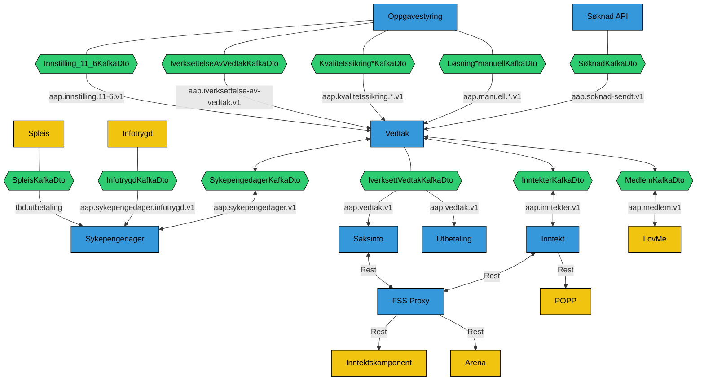

# Arkitektur for AAP
 - Blå: Interne apper
 - Gul: Eksterne apper
 - Grønn: Dto'er
 - Grå: Topic, eller rest-kall

```mermaid
flowchart TD

    %% Interne apper
    A01[Søknad API]:::app
    A02[Vedtak]:::app
    A03[Oppgavestyring]:::app
    A04[Sykepengedager]:::app
    A05[Inntekt]:::app
    A06[FSS Proxy]:::app
    A07[Utbetaling]:::app
    A08[Saksinfo]:::app
    
    %% Eksterne apper
    E01[LovMe]:::ekst
    E02[Inntektskomponent]:::ekst
    E03[Arena]:::ekst
    E04[POPP]:::ekst
    E05[Infotrygd]:::ekst
    E06[Spleis]:::ekst
    
    %% DTO'er
    D01{{SøknadKafkaDto}}:::dto
    D02{{MedlemKafkaDto}}:::dto
    D03{{Løsning*manuellKafkaDto}}:::dto
    D04{{Kvalitetssikring*KafkaDto}}:::dto
    D05{{IverksettelseAvVedtakKafkaDto}}:::dto
    D06{{SykepengedagerKafkaDto}}:::dto
    D07{{Innstilling_11_6KafkaDto}}:::dto
    D08{{InntekterKafkaDto}}:::dto
    D09{{IverksettVedtakKafkaDto}}:::dto
    D10{{InfotrygdKafkaDto}}:::dto
    D11{{SpleisKafkaDto}}:::dto
    
    A01 --- D01
    D01 --> |aap.soknad-sendt.v1| A02
    A02 <--> D02
    D02 <--> |aap.medlem.v1| E01
    A03 --- D03
    D03 --> |aap.manuell.*.v1| A02
    A03 --- D04
    D04 --> |aap.kvalitetssikring.*.v1| A02
    A03 --- D05
    D05 --> |aap.iverksettelse-av-vedtak.v1| A02
    A02 <--> D06
    D06 <--> |aap.sykepengedager.v1| A04
    A03 --- D07
    D07 --> |aap.innstilling.11-6.v1| A02
    A05 <--> |Rest| A06
    A02 <--> D08
    D08 <--> |aap.inntekter.v1| A05
    A02 --- D09
    D09 --> |aap.vedtak.v1| A07
    D09 --> |aap.vedtak.v1| A08
    A08 <--> |Rest| A06
    A06 --> |Rest| E02
    A06 --> |Rest| E03
    A05 --> |Rest| E04
    E05 --- D10
    D10 --> |aap.sykepengedager.infotrygd.v1| A04
    E06 --- D11
    D11 --> |tbd.utbetaling| A04
    
    classDef dto fill:#2ecc71, color:#000000, stroke:#000000;
    classDef app fill:#3498db, color:#000000, stroke:#000000;
    classDef ekst fill:#f1c40f, color:#000000, stroke:#000000;

```