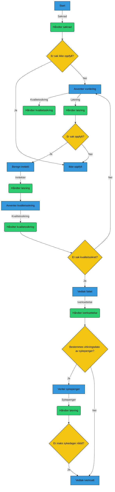

# Flytdiagram for en sak
 - Blå: Tilstander
 - Grønn: Hendelser
 - Gul: Valg

```mermaid

flowchart TD

    %% Tilstander
    T1[Start]:::tilstand
    T2[Avventer vurdering]:::tilstand
    T3[Beregn inntekt]:::tilstand
    T4[Avventer kvalitetssikring]:::tilstand
    T5[Vedtak fattet]:::tilstand
    T6[Venter sykepenger]:::tilstand
    T7[Vedtak iverksatt]:::tilstand
    T8[Ikke oppfylt]:::tilstand

    %% Håndter hendelser
    H11(Håndter søknad):::hendelse
    H21(Håndter løsning):::hendelse
    H22(Håndter kvalitetssikring):::hendelse
    H31(Håndter løsning):::hendelse
    H41(Håndter kvalitetssikring):::hendelse
    H51(Håndter iverksettelse):::hendelse
    H61(Håndter løsning):::hendelse
    
    %% Valg
    V1{Er sak ikke oppfylt?}:::valg
    V2{Er sak oppfylt?}:::valg
    V4{Er sak kvalitetssikret?}:::valg
    V5{Bestemmes virkningsdato av sykepenger?}:::valg
    V6{Er maks sykedager nådd?}:::valg

    %% Graf
    T1 --> |Søknad| H11
    H11 --> V1
    V1 --> |Ja| T8
    V1 --> |Nei| T2
    T2 --> |Kvalitetssikring| H22
    T2 --> |Løsning| H21
    H21 --> V2
    V2 --> |Ja| T3
    V2 --> |Nei| T8
    T3 --> |Inntekter| H31
    H31 --> T4
    T4 --> |Kvalitetssikring| H41
    H41 --> V4
    V4 --> |Ja| T5
    V4 --> |Nei| T2
    T5 --> |Iverksettelse| H51
    H51 --> V5
    V5 --> |Ja| T6
    V5 --> |Nei| T7
    T6 --> |Sykepenger| H61
    H61 --> V6
    V6 --> |Ja| T7

    classDef tilstand fill:#3498db, color:#000000, stroke:#000000;
    classDef hendelse fill:#2ecc71, color:#000000, stroke:#000000;
    classDef valg fill:#f1c40f, color:#000000, stroke:#000000;
    
```