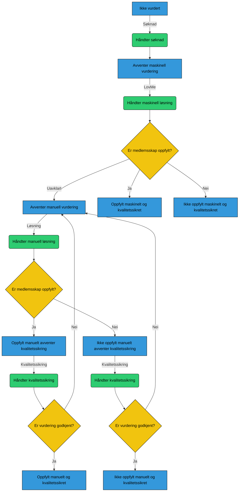

# Tilstandsdiagram for paragraf 11-2 (medlemskap)
- Blå: Tilstander
- Grønn: Håndtering av hendelser
- Gul: Valg

```mermaid

flowchart TD

    %% Tilstander
    T1[Ikke vurdert]:::tilstand
    T2[Avventer maskinell vurdering]:::tilstand
    T3[Avventer manuell vurdering]:::tilstand
    T4[Oppfylt maskinelt og kvalitetssikret]:::tilstand
    T5[Ikke oppfylt maskinelt og kvalitetssikret]:::tilstand
    T6[Oppfylt manuelt avventer kvalitetssikring]:::tilstand
    T7[Oppfylt manuelt og kvalitetssikret]:::tilstand
    T8[Ikke oppfylt manuelt avventer kvalitetssikring]:::tilstand
    T9[Ikke oppfylt manuelt og kvalitetssikret]:::tilstand

    %% Håndter hendelser
    H1(Håndter søknad):::hendelse
    H2(Håndter maskinell løsning):::hendelse
    H3(Håndter manuell løsning):::hendelse
    H6(Håndter kvalitetssikring):::hendelse
    H8(Håndter kvalitetssikring):::hendelse
    
    %% Valg
    V2{Er medlemsskap oppfylt?}:::valg
    V3{Er medlemsskap oppfylt?}:::valg
    V6{Er vurdering godkjent?}:::valg
    V8{Er vurdering godkjent?}:::valg

    %% Graf
    T1 --> |Søknad| H1
    H1 --> T2
    T2 --> |LovMe| H2
    H2 --> V2
    V2 --> |Ja| T4
    V2 --> |Nei| T5
    V2 --> |Uavklart| T3
    T3 --> |Løsning| H3
    H3 --> V3
    V3 --> |Ja| T6
    V3 --> |Nei| T8
    T6 --> |Kvalitetssikring| H6
    H6 --> V6
    V6 --> |Ja| T7
    V6 --> |Nei| T3
    T8 --> |Kvalitetssikring| H8
    H8 --> V8
    V8 --> |Ja| T9
    V8 --> |Nei| T3

    classDef tilstand fill:#3498db, color:#000000, stroke:#000000;
    classDef hendelse fill:#2ecc71, color:#000000, stroke:#000000;
    classDef valg fill:#f1c40f, color:#000000, stroke:#000000;
    
```