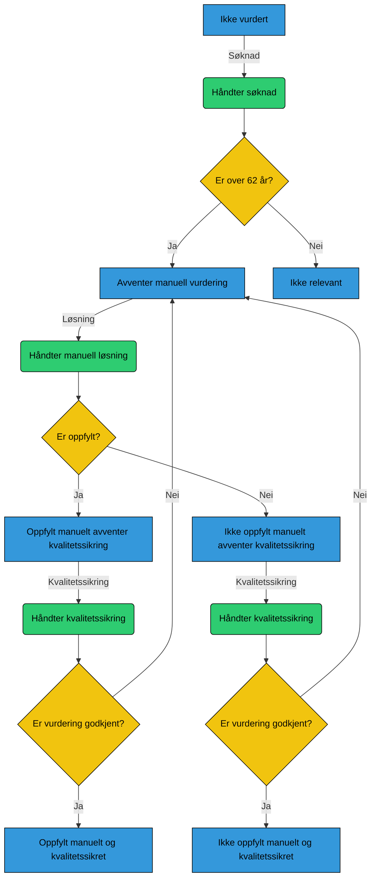

# Tilstandsdiagram for paragraf 11-4 andre og tredje ledd (alder over 62)
- Blå: Tilstander
- Grønn: Håndtering av hendelser
- Gul: Valg

```mermaid

flowchart TD
    
    T1[Ikke vurdert]:::tilstand
    T2[Avventer manuell vurdering]:::tilstand
    T3[Oppfylt manuelt avventer kvalitetssikring]:::tilstand
    T4[Oppfylt manuelt og kvalitetssikret]:::tilstand
    T5[Ikke oppfylt manuelt avventer kvalitetssikring]:::tilstand
    T6[Ikke oppfylt manuelt og kvalitetssikret]:::tilstand
    T7[Ikke relevant]:::tilstand
    
    H1(Håndter søknad):::hendelse
    H2(Håndter manuell løsning):::hendelse
    H3(Håndter kvalitetssikring):::hendelse
    H5(Håndter kvalitetssikring):::hendelse
    
    V1{Er over 62 år?}:::valg
    V2{Er oppfylt?}:::valg
    V3{Er vurdering godkjent?}:::valg
    V5{Er vurdering godkjent?}:::valg
    
    T1 --> |Søknad| H1
    H1 --> V1
    V1 --> |Ja| T2
    V1 --> |Nei| T7
    T2 --> |Løsning| H2
    H2 --> V2
    V2 --> |Ja| T3
    V2 --> |Nei| T5
    T3 --> |Kvalitetssikring| H3
    H3 --> V3
    V3 --> |Ja| T4
    V3 --> |Nei| T2
    T5 --> |Kvalitetssikring| H5
    H5 --> V5
    V5 --> |Ja| T6
    V5 --> |Nei| T2
    
    classDef tilstand fill:#3498db, color:#000000, stroke:#000000;
    classDef hendelse fill:#2ecc71, color:#000000, stroke:#000000;
    classDef valg fill:#f1c40f, color:#000000, stroke:#000000;

```