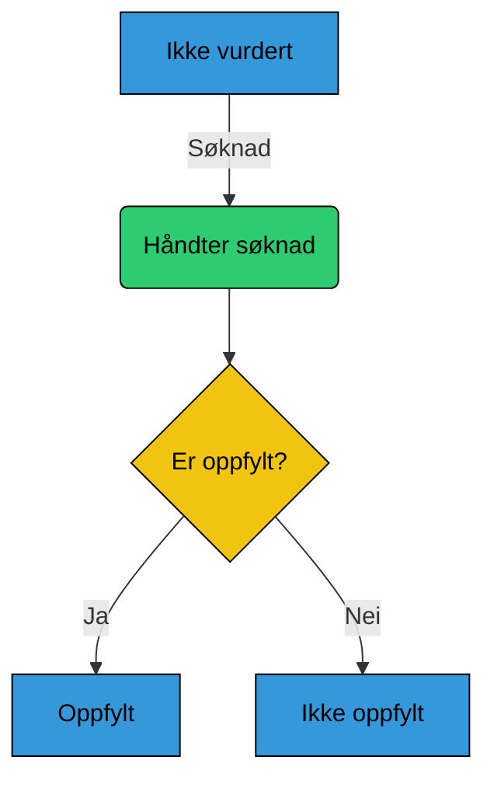

# Tilstandsdiagram for paragraf 11-4 første ledd (alder)
- Blå: Tilstander
- Grønn: Håndtering av hendelser
- Gul: Valg

```mermaid

flowchart TD
    
    T1[Ikke vurdert]:::tilstand
    T2[Oppfylt]:::tilstand
    T3[Ikke oppfylt]:::tilstand
    
    H1(Håndter søknad):::hendelse
    
    V1{Er oppfylt?}:::valg
    
    T1 --> |Søknad| H1
    H1 --> V1
    V1 --> |Ja| T2
    V1 --> |Nei| T3
    
    classDef tilstand fill:#3498db, color:#000000, stroke:#000000;
    classDef hendelse fill:#2ecc71, color:#000000, stroke:#000000;
    classDef valg fill:#f1c40f, color:#000000, stroke:#000000;

```